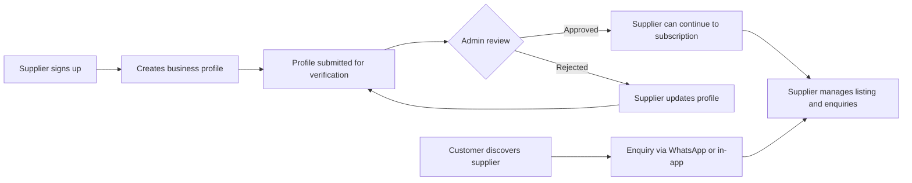

# GrowMeOnline — Find Trusted Local Suppliers


## Project Overview

GrowMeOnline is a business marketplace connecting customers with local suppliers and service providers. Customers can discover supplier listings and send enquiries through WhatsApp or in-app messaging. Suppliers can manage their business presence, respond to enquiries, and access subscription features. Administrators review supplier profiles and manage marketplace categories.

The application is built with React, TypeScript, TanStack Start, and Supabase. Its interface includes public marketplace pages, supplier tools, and a separate administration area.

## Branch Structure

- **`main`** — primary branch for the application
- **Feature branches** — use focused branches for individual changes and pull requests

## Features

### Customer marketplace

- Browse supplier listings and categories.
- View supplier profiles and business details.
- Contact suppliers using WhatsApp or in-app enquiries.

### Supplier portal

- Create an account and manage a business profile.
- Track supplier profile verification and subscription status.
- View and manage enquiries, reviews, and analytics.
- Configure account settings and subscription details.

### Administration

- Review supplier profiles and approve or reject verification requests.
- Manage marketplace categories.
- Review supplier and enquiry information and access audit-log pages.

## Supplier Workflow



## Application Structure

```text
remix-of-connect-grow/
├── public/                      # Static assets
├── src/
│   ├── components/
│   │   ├── admin/               # Administration UI
│   │   ├── customer/            # Customer marketplace and enquiry UI
│   │   ├── landing/              # Landing page sections and navigation
│   │   ├── supplier/             # Supplier portal UI
│   │   └── ui/                   # Shared UI components
│   ├── hooks/                    # Shared React hooks
│   ├── integrations/supabase/    # Supabase clients, middleware, and types
│   ├── lib/                      # Application services and business logic
│   ├── routes/                   # TanStack Start file-based routes
│   ├── routeTree.gen.ts          # Generated route tree
│   └── styles.css                # Global styles
├── supabase/                     # Supabase project configuration
├── package.json
└── README.md
```

### Main routes

| Area                    | Routes                                                                                                                                                                                                                          |
| ----------------------- | ------------------------------------------------------------------------------------------------------------------------------------------------------------------------------------------------------------------------------- |
| Public                  | `/`, `/suppliers`, `/suppliers/$slug`                                                                                                                                                                                           |
| Customer authentication | `/login`, `/forgot-password`, `/reset-password`                                                                                                                                                                                 |
| Supplier                | `/supplier/signup`, `/supplier/onboarding`, `/supplier/dashboard`, `/supplier/profile`, `/supplier/enquiries`, `/supplier/reviews`, `/supplier/analytics`, `/supplier/subscription`, `/supplier/checkout`, `/supplier/settings` |
| Administration          | `/admin/login`, `/admin/dashboard`, `/admin/suppliers`, `/admin/verification`, `/admin/categories`, `/admin/enquiries`, `/admin/audit-log`                                                                                      |
| Integrations            | `/mcp`, `/.well-known/oauth-protected-resource`                                                                                                                                                                                 |

Routes are generated from files under `src/routes/`. See [src/routes/README.md](./src/routes/README.md) for routing conventions. Do not edit `src/routeTree.gen.ts` by hand.

## Technology Stack

- **Frontend:** React 19, TypeScript, Tailwind CSS 4, Radix UI
- **Routing and server rendering:** TanStack Start and TanStack Router
- **Data fetching:** TanStack Query
- **Backend services:** Supabase Postgres, Auth, Storage, and Edge Functions
- **Forms and validation:** React Hook Form and Zod
- **Build and development:** Vite

## Getting Started

### Prerequisites

- Node.js (use a current LTS release)
- npm
- A Supabase project with the required database schema, authentication, and storage configured

### Installation

```sh
git clone https://github.com/Mthoko001/remix-of-connect-grow.git
cd remix-of-connect-grow
npm install
```

Create a local `.env` file and provide the values for your Supabase project:

```dotenv
SUPABASE_URL=https://your-project-ref.supabase.co
SUPABASE_PUBLISHABLE_KEY=your-supabase-publishable-key
VITE_SUPABASE_URL=https://your-project-ref.supabase.co
VITE_SUPABASE_PUBLISHABLE_KEY=your-supabase-publishable-key
```

The client and server integrations use the Supabase URL and publishable key. Depending on the features and deployment environment you enable, additional server-side settings may be required (for example `SUPABASE_SERVICE_ROLE_KEY` or `LOVABLE_CRON_SECRET`). Set those only in a trusted server environment. **Never expose service-role keys or other server secrets to the browser or commit them to source control.**

Start the development server:

```sh
npm run dev
```

## Available Scripts

| Command             | Description                          |
| ------------------- | ------------------------------------ |
| `npm run dev`       | Start the local development server   |
| `npm run build`     | Create a production build            |
| `npm run build:dev` | Create a development-mode build      |
| `npm run preview`   | Preview the production build locally |
| `npm run lint`      | Run ESLint                           |

## Supabase Data

The generated database types in `src/integrations/supabase/types.ts` describe the application's current data model, including supplier accounts and profiles, categories, enquiries, subscriptions, and admin accounts. Database access is implemented in `src/integrations/supabase/` and application services under `src/lib/`.

Configure and secure the Supabase project independently of the frontend. In particular, use appropriate Row Level Security policies and storage policies for customer, supplier, and administrator data. Do not rely on client-side checks as authorization.

## Contributing

1. Create a focused feature branch.
2. Make and verify the change locally.
3. Run `npm run lint` and `npm run build` when appropriate.
4. Open a pull request describing the change and any required Supabase configuration or migration.

---

GrowMeOnline helps customers connect with trusted local businesses and gives suppliers the tools to build their presence and manage new enquiries.
