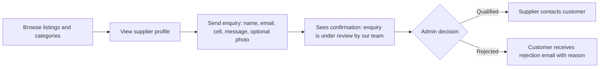
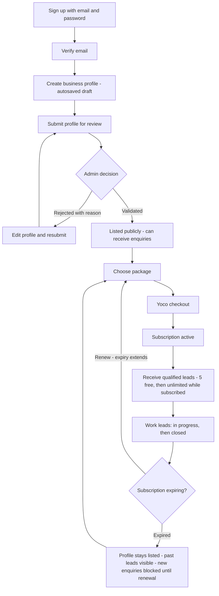
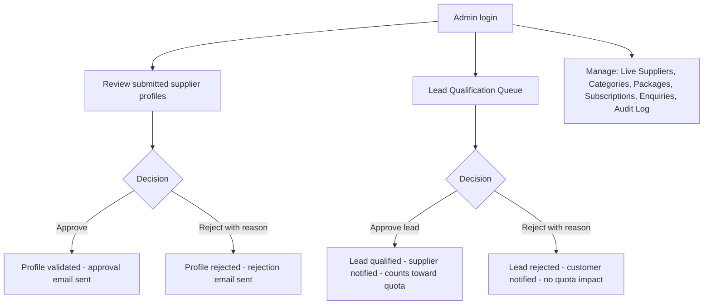
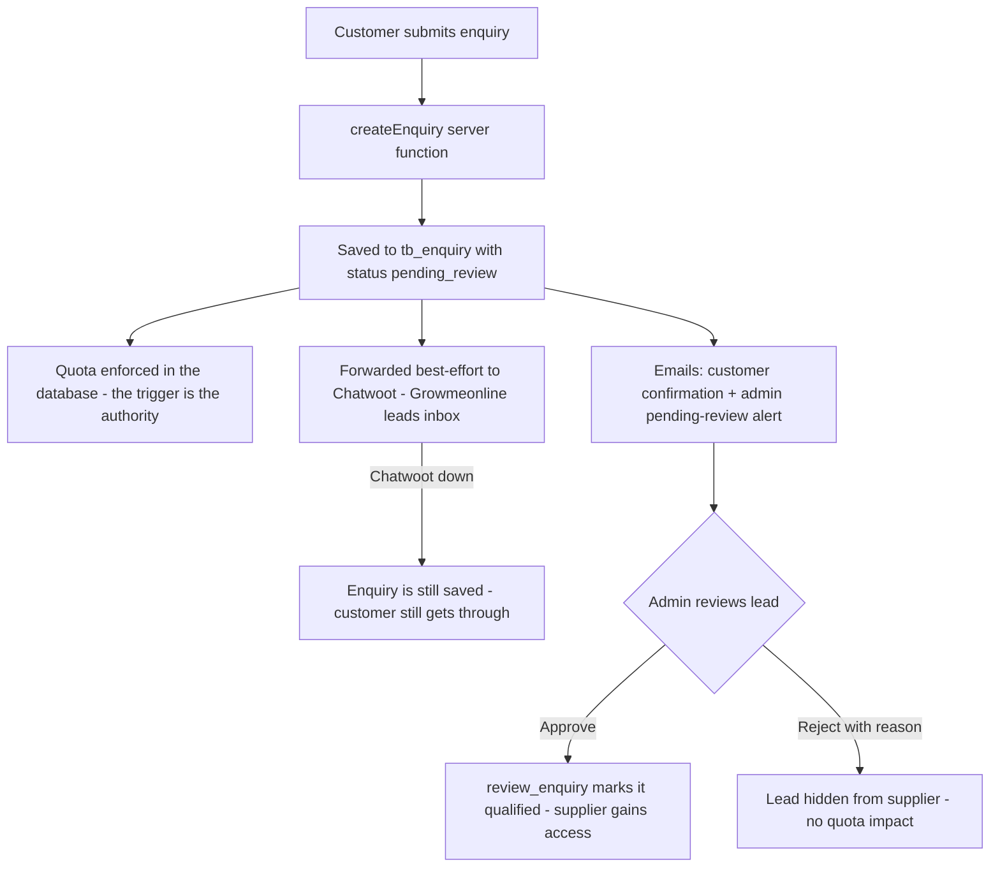
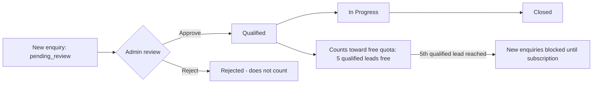
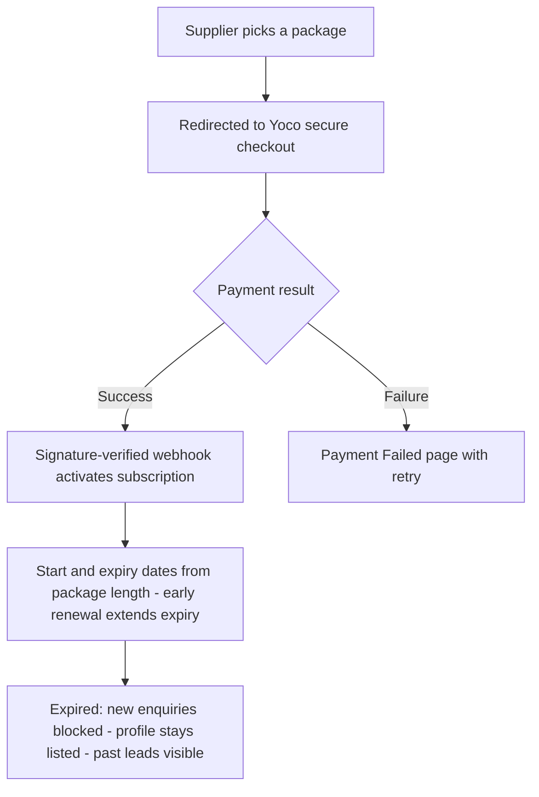

# GrowMeOnline — Find Trusted Local Suppliers


## Project Overview

GrowMeOnline is a business marketplace connecting customers with local suppliers and service providers. Customers can discover supplier listings and send enquiries through in-app messaging. Suppliers can manage their business presence, respond to qualified leads, and access subscription features. Administrators review supplier profiles, qualify incoming leads, and manage marketplace categories, packages, and subscriptions.

The application is built with React, TypeScript, TanStack Start, and Supabase. Its interface includes public marketplace pages, supplier tools, and a separate administration area.

## Process Flows

The diagrams below reflect what is implemented today. Items not yet built (for example subscription expiry reminder emails) are listed under [Coming next](#coming-next).

### Status legend

Supplier profile verification status and lead status appear throughout the flows:

| Supplier profile status | Meaning |
| --- | --- |
| `draft` | Profile being edited, not yet submitted |
| `pending_verification` | Submitted, awaiting admin review |
| `validated` | Admin approved — listed publicly, can receive enquiries |
| `rejected` | Admin rejected — supplier edits and resubmits |

| Lead (enquiry) status | Meaning |
| --- | --- |
| `pending_review` | Customer submitted, awaiting admin review (hidden from supplier) |
| `qualified` | Admin approved — visible to supplier, counts toward free quota |
| `rejected` | Admin rejected — hidden from supplier, does not count toward quota |
| `in_progress` | Supplier actively working on the lead |
| `closed` | Lead completed |

### Customer journey



Every enquiry is first reviewed by an admin before a supplier ever sees it. Suppliers can only see qualified, in-progress, and closed leads — never pending or rejected ones.

### Supplier journey



Sign-up also offers a Google button, which is a visible placeholder until Google OAuth is wired up. The first 5 qualified leads are free; after that, an active subscription is required to keep receiving leads.

### Admin workflow



### System data flow



Notes:

- The database is the only place customers and suppliers cannot bypass — UI checks are convenience only, and the free-lead quota is enforced by a database trigger.
- Chatwoot and email sends are best-effort: a failure in either never loses an enquiry.

### Lead qualification and free quota



Only `qualified` leads count toward the free quota. `pending_review`, `rejected`, and `closed` leads never consume it.

### Payments



A subscription only becomes active when Yoco itself confirms the payment through a signature-verified webhook, so payment status never relies on browser logic.

### Notifications map

| Email | Recipient | Trigger |
| --- | --- | --- |
| Profile Submitted | Supplier | Supplier submits profile for review |
| Profile Approved | Supplier | Admin validates profile |
| Profile Rejected | Supplier | Admin rejects profile |
| Enquiry Received | Customer | Enquiry submitted |
| New Enquiry Pending Review | All active admins | Enquiry submitted |
| New Qualified Lead | Supplier | Admin approves a lead |
| Enquiry Update (rejected) | Customer | Admin rejects a lead, includes reason |
| Subscription Activated | Supplier | Yoco webhook confirms payment |
| Payment Unsuccessful | Supplier | Yoco reports a failed payment |
| Signup confirmation / Password recovery / Email change | Account owner | Supabase Auth events |

All transactional emails use the GrowMeOnline-branded templates in `src/lib/email-templates/` and are sent best-effort — an email failure never blocks the underlying action.

## Coming next

- Subscription expiry reminder emails (30/7/1 days before expiry) — needs a scheduled job.
- Live Yoco payments — blocked on the merchant account (secret key + webhook registration).
- Google OAuth sign-in — button and code path are in place, awaiting activation.
- Automated lead qualification (spam scoring, duplicate detection) — designed to reuse the same `review_enquiry` database function.

## Branch Structure

- **`main`** — primary branch for the application
- **Feature branches** — use focused branches for individual changes and pull requests

## Features

### Customer marketplace

- Browse supplier listings and categories.
- View supplier profiles and business details.
- Contact suppliers using in-app enquiries, reviewed by the team before delivery.

### Supplier portal

- Create an account and manage a business profile.
- Track supplier profile verification and subscription status.
- View and manage qualified leads, reviews, and analytics.
- Configure account settings and subscription details.

### Administration

- Review supplier profiles and approve or reject verification requests.
- Review and qualify incoming customer leads (approve or reject with a reason).
- Manage marketplace categories, packages, subscriptions, and audit logs.

## Application Structure

```text
GrowMeOnline/
├── public/                      # Static assets
├── src/
│   ├── components/
│   │   ├── admin/               # Administration UI
│   │   ├── customer/            # Customer marketplace and enquiry UI
│   │   ├── landing/              # Landing page sections and navigation
│   │   ├── supplier/             # Supplier portal UI
│   │   └── ui/                   # Shared UI components
│   ├── hooks/                    # Shared React hooks
│   ├── integrations/supabase/    # Supabase clients, middleware, and types
│   ├── lib/                      # Application services and business logic
│   ├── routes/                   # TanStack Start file-based routes
│   ├── routeTree.gen.ts          # Generated route tree
│   └── styles.css                # Global styles
├── supabase/                     # Supabase project configuration
├── package.json
└── README.md
```

### Main routes

| Area                    | Routes                                                                                                                                                                                                                          |
| ----------------------- | ------------------------------------------------------------------------------------------------------------------------------------------------------------------------------------------------------------------------------- |
| Public                  | `/`, `/suppliers`, `/suppliers/$slug`, `/pricing`                                                                                                                                                                               |
| Customer authentication | `/login`, `/forgot-password`, `/reset-password`                                                                                                                                                                                 |
| Supplier                | `/supplier/signup`, `/supplier/dashboard`, `/supplier/profile`, `/supplier/enquiries`, `/supplier/reviews`, `/supplier/analytics`, `/supplier/subscription`, `/supplier/checkout`, `/supplier/settings`                         |
| Administration          | `/admin/login`, `/admin/dashboard`, `/admin/suppliers`, `/admin/verification`, `/admin/categories`, `/admin/packages`, `/admin/enquiries`, `/admin/subscriptions`, `/admin/audit-log`                                           |
| Integrations            | `/mcp`, `/.well-known/oauth-protected-resource`                                                                                                                                                                                 |

Routes are generated from files under `src/routes/`. See [src/routes/README.md](./src/routes/README.md) for routing conventions. Do not edit `src/routeTree.gen.ts` by hand.

## Technology Stack

- **Frontend:** React 19, TypeScript, Tailwind CSS 4, Radix UI
- **Routing and server rendering:** TanStack Start and TanStack Router
- **Data fetching:** TanStack Query
- **Backend services:** Supabase Postgres, Auth, Storage, and Edge Functions
- **Payments:** Yoco (hosted checkout + signature-verified webhook)
- **Lead inbox:** Chatwoot ("Growmeonline leads" inbox, best-effort forwarding)
- **Forms and validation:** React Hook Form and Zod
- **Build and development:** Vite

## Getting Started

### Prerequisites

- Node.js (use a current LTS release)
- npm
- A Supabase project with the required database schema, authentication, and storage configured

### Installation

```sh
git clone https://github.com/Mthoko001/GrowMeOnline.git
cd GrowMeOnline
npm install
```

Create a local `.env` file and provide the values for your Supabase project:

```dotenv
SUPABASE_URL=https://your-project-ref.supabase.co
SUPABASE_PUBLISHABLE_KEY=your-supabase-publishable-key
VITE_SUPABASE_URL=https://your-project-ref.supabase.co
VITE_SUPABASE_PUBLISHABLE_KEY=your-supabase-publishable-key
# Optional: enables AI-assisted business-description improvement (server-side)
GEMINI_API_KEY=your-gemini-api-key
```

The client and server integrations use the Supabase URL and publishable key. Server-side integrations (AI description improvement, Chatwoot forwarding, Yoco payment confirmation) read their credentials from server-side environment variables only — never from the browser. Depending on the features and deployment environment you enable, additional server-side settings may be required (for example `SUPABASE_SERVICE_ROLE_KEY`, `CHATWOOT_API_TOKEN`, `YOCO_SECRET_KEY`, or `LOVABLE_CRON_SECRET`). Set those only in a trusted server environment. **Never expose service-role keys or other server secrets to the browser or commit them to source control.**

Start the development server:

```sh
npm run dev
```

## Available Scripts

| Command             | Description                          |
| ------------------- | ------------------------------------ |
| `npm run dev`       | Start the local development server   |
| `npm run build`     | Create a production build            |
| `npm run build:dev` | Create a development-mode build      |
| `npm run preview`   | Preview the production build locally |
| `npm run lint`      | Run ESLint                           |

## Supabase Data

The generated database types in `src/integrations/supabase/types.ts` describe the application's current data model, including supplier accounts and profiles, categories, enquiries (with lead-review status and rejection reasons), subscriptions, and admin accounts. Database access is implemented in `src/integrations/supabase/` and application services under `src/lib/`.

Configure and secure the Supabase project independently of the frontend. In particular, use appropriate Row Level Security policies and storage policies for customer, supplier, and administrator data. Do not rely on client-side checks as authorization — the free-lead quota and lead-visibility rules are also enforced in the database itself.

## Contributing

1. Create a focused feature branch.
2. Make and verify the change locally.
3. Run `npm run lint` and `npm run build` when appropriate.
4. Open a pull request describing the change and any required Supabase configuration or migration.

---

GrowMeOnline helps customers connect with trusted local businesses and gives suppliers the tools to build their presence and manage new enquiries.
